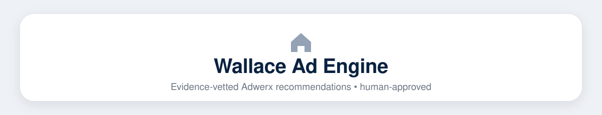

   

> &#128308; **New this week** &mdash; open the [latest brief](briefs/2026-08-14-brief.md) and tick each campaign's checkboxes (Reviewed / Launched / Skipped) so everyone can see what's been handled.

 4 recruiting campaign(s) in the [latest brief](briefs/2026-08-14-brief.md).

### This week at a glance

| Campaign | Score | Type | Suggested spend |
|---|---|---|---|
| &#11088; [Wallace - resources commercial](briefs/2026-08-14-brief.md) | **90**/100 | Retargeting (site visitors) | **$330/mo** |
| [Wallace - listing 1324201 173-rafter-road-tellico-plains-tn-37385](briefs/2026-08-14-brief.md) | **88**/100 | Retargeting (site visitors) | **$330/mo** |
| [Wallace - listing 1325783 5401-mill-ridge-drive-knoxville-tn-37919](briefs/2026-08-14-brief.md) | **86**/100 | Retargeting (site visitors) | **$320/mo** |
| [Wallace - by-town louisville-tn](briefs/2026-08-14-brief.md) | **73**/100 | Zip-code / audience targeting | **$270/mo** |
| [Wallace - listing 1254446 1505-duncan-road-knoxville-tn-37919](briefs/2026-08-14-brief.md) | **69**/100 | Zip-code / audience targeting | **$250/mo** |
| [Wallace - homepage](briefs/2026-08-14-brief.md) | **68**/100 | Retargeting (site visitors) | backup |
| [Wallace - by-town powell-tn](briefs/2026-08-14-brief.md) | **67**/100 | Zip-code / audience targeting | backup |
| [Wallace - by-town oneida-tn](briefs/2026-08-14-brief.md) | **67**/100 | Zip-code / audience targeting | backup |
| [Wallace - listings saved-search 817651](briefs/2026-08-14-brief.md) | **66**/100 | Zip-code / audience targeting | backup |
| [Wallace - realestate agent vickie-bailey](briefs/2026-08-14-brief.md) | **64**/100 | Zip-code / audience targeting | backup |
| _...and 5 more_ | | |

### How this works

1. Every **Tuesday** the engine scans GSC + GA4 (+ SEMrush) for pages gaining traction or already converting.
2. Each candidate passes a **7-gate vetting** (organic overlap, economics, page health, conversion proof, demand, history, budget fit).
3. Survivors become **Adwerx-ready briefs** with copy, image ideas, targeting, and a paste-ready tracking link.
4. Every **Friday** the scorecard grades live campaigns from GA4 with day-30/60/90 checkpoints.
5. **Nothing launches automatically** &mdash; a human approves every campaign and all spend.
